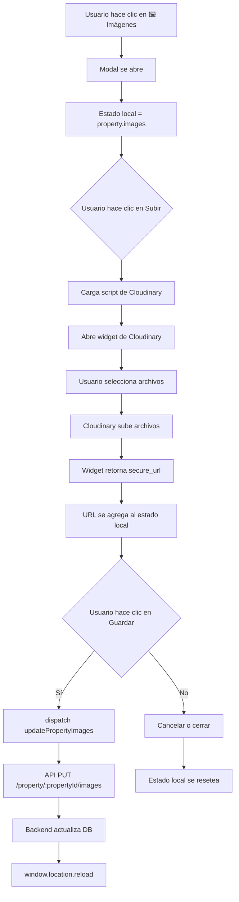

# 🖼️ Componente ImageManager - Gestión de Imágenes

## 📋 Descripción

Componente React que permite agregar y eliminar imágenes de propiedades **ya creadas** desde el listado, utilizando el **widget de Cloudinary** para la carga directa de archivos.

## 🎯 Funcionalidades

### 1. **Subir nuevas imágenes con Cloudinary**
- Abre el widget oficial de Cloudinary
- Permite selección múltiple de archivos
- Carga directa a la nube
- URLs generadas automáticamente

### 2. **Visualizar imágenes actuales**
- Grid responsive (1 columna mobile, 2 desktop)
- Thumbnails con aspect ratio 16:9
- Manejo de errores de carga

### 3. **Eliminar imágenes**
- Botón individual por cada imagen
- Eliminación inmediata del listado local

### 4. **Guardar cambios**
- Llamada a Redux action `updatePropertyImages`
- Loading state durante la operación
- Recarga automática después de guardar

## 🚀 Ubicación

```
QL Front/src/Components/Propiedades/ImageManager.jsx
```

## 🔌 Integración

### En `Listado.jsx`:

```javascript
import ImageManager from './ImageManager';

// Dentro del renderizado de cada card:
<ImageManager property={property} />
```

**Orden de botones:**
1. ✏️ Editar
2. 💬 WhatsApp
3. 🖼️ **Imágenes** (nuevo)
4. 🗑️ Eliminar

## 📊 Props

| Prop | Tipo | Requerido | Descripción |
|------|------|-----------|-------------|
| `property` | Object | ✅ Sí | Objeto de propiedad completo |

### Estructura de `property`:

```javascript
{
  propertyId: number,
  title: string,
  tipoPropiedad: string,
  images: string[], // Array de URLs
  // ... otros campos
}
```

## 🎨 UI/UX

### **Modal centrado** con:

1. **Header fijo:**
   - Título: "Gestionar Imágenes - {title o tipoPropiedad}"
   - Botón cerrar (×)

2. **Body scrolleable:**
   - **Sección agregar:**
     - Botón "☁️ Subir Imágenes a Cloudinary"
     - Abre widget de Cloudinary al hacer clic
     - Hint: "Haz clic para abrir el widget de Cloudinary y subir múltiples imágenes"
   
   - **Sección lista:**
     - Grid de cards
     - Cada card: thumbnail + URL + botón eliminar

3. **Footer fijo:**
   - Botón "Cancelar" (descarta cambios)
   - Botón "💾 Guardar Cambios" (persiste)

### **Estados visuales:**

```javascript
// Sin imágenes
<div className="text-center py-8 text-gray-400">
  No hay imágenes. Agrega una usando el campo de arriba.
</div>

// Con imágenes
<div className="grid grid-cols-1 sm:grid-cols-2 gap-4">
  {/* Cards de imágenes */}
</div>

// Guardando
<button disabled className="... disabled:opacity-50">
  <span className="animate-spin">⏳</span>
  Guardando...
</button>
```

## 🔄 Flujo de Datos



## 📡 Redux Action Utilizada

```javascript
// QL Front/src/redux/Actions/actions.js

export const updatePropertyImages = (propertyId, images) => {
  return async (dispatch) => {
    try {
      const response = await axios.put(
        `${API_URL}/property/${propertyId}/images`,
        { images },
        { withCredentials: true }
      );
      
      dispatch({ type: "UPDATE_PROPERTY_IMAGES", payload: response.data });
      return response.data;
    } catch (error) {
      console.error("Error updating property images:", error);
      throw error;
    }
  };
};
```

## 🛠️ Endpoint Backend

```javascript
// PUT /property/:propertyId/images
// Body: { images: ["url1", "url2", ...] }

router.put("/:propertyId/images", async (req, res) => {
  const { propertyId } = req.params;
  const { images } = req.body;
  
  await Property.update({ images }, { where: { propertyId } });
  
  res.json({ message: "Imágenes actualizadas" });
});
```

## ✅ Validaciones

### Frontend:
```javascript
// Carga del script de Cloudinary
try {
  await loadCloudinaryScript();
  openCloudinaryWidget((uploadedImageUrl) => {
    setImages((prevImages) => [...prevImages, uploadedImageUrl]);
  });
} catch (error) {
  console.error("Error al cargar el script de Cloudinary:", error);
  alert("Error al abrir el widget de Cloudinary");
}
```

### Cloudinary Widget Config:
```javascript
// cloudinaryConfig.js
{
  cloudName: 'dachr5i8f',
  uploadPreset: 'propiedades',
  multiple: true,  // ✅ Permite subir múltiples archivos
  folder: 'packs'
}
```

## 🎯 Casos de Uso

### 1. **Propiedad sin imágenes**
- Usuario crea propiedad sin imágenes
- Abre ImageManager desde el listado
- Hace clic en "Subir Imágenes"
- Widget de Cloudinary permite seleccionar múltiples archivos
- Las imágenes se suben automáticamente
- Guarda y las imágenes quedan asociadas

### 2. **Agregar más imágenes**
- Propiedad tiene 2 imágenes
- Usuario quiere agregar 3 más
- Abre widget y selecciona las 3 nuevas
- Todas se agregan al listado
- Guarda y ahora tiene 5 imágenes

### 3. **Reemplazar imagen incorrecta**
- Imagen actual está borrosa o incorrecta
- Usuario la elimina
- Sube una nueva con mejor calidad
- Guarda los cambios

## 🐛 Manejo de Errores

### **Error al cargar thumbnail:**
```javascript
 {
    e.target.src = "https://via.placeholder.com/300x200?text=Error+al+cargar";
  }}
/>
```

### **Error al guardar:**
```javascript
catch (error) {
  console.error("Error al actualizar imágenes:", error);
  alert("Error al actualizar las imágenes");
}
```

## 📱 Responsive

```css
/* Mobile: 1 columna */
grid-cols-1

/* Desktop (sm+): 2 columnas */
sm:grid-cols-2

/* Modal adaptable */
max-w-3xl w-full max-h-[90vh] overflow-y-auto
```

## 🚀 Mejoras Futuras

1. **Drag & Drop para reordenar**
   - Usar react-beautiful-dnd
   - Persistir orden en DB

2. **Upload directo a Cloudinary**
   - Integrar widget de Cloudinary
   - Eliminar paso manual de copiar URL

3. **Previsualización antes de guardar**
   - Mostrar cómo quedará la propiedad
   - Confirmar antes de persistir

4. **Edición de imágenes**
   - Crop
   - Filtros
   - Rotación

5. **Validación avanzada**
   - Verificar que URL sea de Cloudinary
   - Limitar cantidad de imágenes
   - Validar tamaño/formato

## 📄 Código Completo

Ver archivo: `QL Front/src/Components/Propiedades/ImageManager.jsx`

---

**Creado:** ${new Date().toLocaleDateString('es-AR')}  
**Estado:** ✅ IMPLEMENTADO
