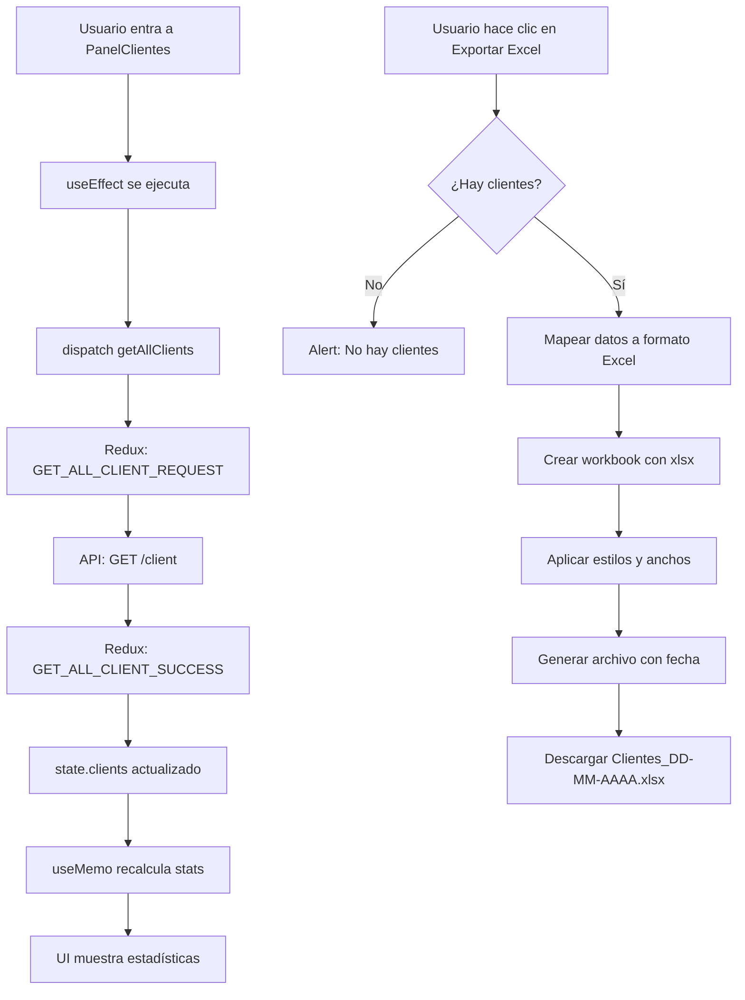

# 📊 Estadísticas y Exportación de Clientes

## 🎯 Funcionalidades Implementadas

### 1. **Estadísticas en Tiempo Real**

El panel de clientes ahora muestra estadísticas dinámicas calculadas a partir de los datos reales:

#### **Total Clientes**
- Cuenta todos los clientes registrados en el sistema
- Color: Azul

#### **Nuevos (Mes)**
- Clientes creados en el mes actual
- Usa el campo `createdAt` para filtrar
- Color: Verde

#### **Con Propiedades**
- Clientes que tienen al menos 1 propiedad asignada
- Verifica `client.properties.length > 0`
- Color: Ámbar

#### **Con Contratos**
- Clientes con al menos 1 contrato (lease) activo
- Verifica `client.leases.length > 0`
- Color: Púrpura

---

## 📥 Exportación a Excel

### **Botón "Exportar Excel"**

Ubicado en el header de la sección de estadísticas, permite descargar un archivo Excel con toda la información de clientes.

### **Datos Exportados:**

| Columna | Fuente | Descripción |
|---------|--------|-------------|
| CUIL | `client.cuil` | Identificación única |
| Nombre | `client.name` | Nombre completo |
| Email | `client.email` | Correo electrónico |
| Teléfono | `client.mobilePhone` | Número móvil |
| Dirección | `client.direccion` | Domicilio |
| Ciudad | `client.ciudad` | Ciudad de residencia |
| Provincia | `client.provincia` | Provincia |
| Propiedades | `client.properties.length` | Cantidad de propiedades |
| Contratos | `client.leases.length` | Cantidad de contratos |
| Fecha Creación | `client.createdAt` | Fecha de registro (formato DD/MM/AAAA) |

### **Características del Excel:**

✅ **Anchos de columna optimizados** - Cada columna tiene un ancho apropiado  
✅ **Nombre dinámico** - `Clientes_DD-MM-AAAA.xlsx`  
✅ **Formato .xlsx** - Compatible con Excel, Google Sheets, LibreOffice  
✅ **Hoja nombrada** - "Clientes"  
✅ **Validación** - No exporta si no hay clientes

---

## 🔧 Implementación Técnica

### **Librería Utilizada:**

```bash
npm install xlsx
```

**xlsx** - Librería líder para manipulación de archivos Excel en JavaScript

### **Imports Necesarios:**

```javascript
import { useEffect, useMemo } from 'react';
import { useDispatch, useSelector } from 'react-redux';
import { getAllClients } from '../../redux/Actions/actions';
import * as XLSX from 'xlsx';
```

### **Cálculo de Estadísticas con useMemo:**

```javascript
const stats = useMemo(() => {
  const totalClientes = clients.length;
  
  // Clientes nuevos del mes actual
  const now = new Date();
  const currentMonth = now.getMonth();
  const currentYear = now.getFullYear();
  
  const nuevosDelMes = clients.filter(client => {
    if (!client.createdAt) return false;
    const createdDate = new Date(client.createdAt);
    return createdDate.getMonth() === currentMonth && 
           createdDate.getFullYear() === currentYear;
  }).length;

  // Clientes con propiedades (activos)
  const activos = clients.filter(client => 
    client.properties && client.properties.length > 0
  ).length;

  // Clientes con contratos
  const conContratos = clients.filter(client => 
    client.leases && client.leases.length > 0
  ).length;

  return {
    totalClientes,
    nuevosDelMes,
    activos,
    conContratos
  };
}, [clients]);
```

**¿Por qué useMemo?**
- Evita recalcular las estadísticas en cada render
- Solo recalcula cuando `clients` cambia
- Optimiza el rendimiento

### **Función de Exportación:**

```javascript
const handleExportExcel = () => {
  if (clients.length === 0) {
    alert('No hay clientes para exportar');
    return;
  }

  // Preparar datos
  const excelData = clients.map(client => ({
    'CUIL': client.cuil || '',
    'Nombre': client.name || '',
    // ... otros campos
  }));

  // Crear workbook y worksheet
  const wb = XLSX.utils.book_new();
  const ws = XLSX.utils.json_to_sheet(excelData);

  // Ajustar ancho de columnas
  ws['!cols'] = [
    { wch: 15 }, // CUIL
    { wch: 30 }, // Nombre
    // ... otros anchos
  ];

  // Agregar worksheet al workbook
  XLSX.utils.book_append_sheet(wb, ws, 'Clientes');

  // Generar nombre con fecha
  const fecha = new Date().toLocaleDateString('es-AR').replace(/\//g, '-');
  const filename = `Clientes_${fecha}.xlsx`;

  // Descargar
  XLSX.writeFile(wb, filename);
};
```

---

## 🎨 UI/UX

### **Loading State:**

Mientras carga los datos:
```jsx
<div className="text-center py-8">
  <div className="animate-spin rounded-full h-12 w-12 border-b-2 border-blue-400 mx-auto"></div>
  <p className="text-slate-300 mt-4">Cargando estadísticas...</p>
</div>
```

### **Botón de Exportación:**

```jsx
<button
  onClick={handleExportExcel}
  disabled={loading || clients.length === 0}
  className="flex items-center space-x-2 px-4 py-2 bg-emerald-500/20 hover:bg-emerald-500/30 text-emerald-400 rounded-lg border border-emerald-400/30 transition-all duration-300 disabled:opacity-50 disabled:cursor-not-allowed"
>
  <IoDownloadOutline className="w-5 h-5" />
  <span className="hidden sm:inline">Exportar Excel</span>
  <span className="sm:hidden">Excel</span>
</button>
```

**Estados:**
- ✅ Normal: Verde con hover
- ⏳ Loading: Deshabilitado con opacidad
- 📭 Sin datos: Deshabilitado con tooltip

### **Cards de Estadísticas:**

```jsx
<div className="text-center p-4 bg-white/5 rounded-xl border border-white/10 hover:bg-white/10 transition-colors duration-300">
  <p className="text-2xl sm:text-3xl font-bold text-blue-400">125</p>
  <p className="text-xs text-slate-300 mt-1">Total Clientes</p>
</div>
```

**Responsive:**
- Mobile: 2 columnas
- Tablet+: 4 columnas (sm:grid-cols-4)

---

## 📊 Flujo de Datos



---

## 🧪 Testing Manual

### **Escenario 1: Ver estadísticas**
1. ✅ Entrar a /panelClientes
2. ✅ Ver loading spinner
3. ✅ Ver estadísticas actualizadas

### **Escenario 2: Exportar con datos**
1. ✅ Tener clientes en la BD
2. ✅ Hacer clic en "Exportar Excel"
3. ✅ Descargar archivo `Clientes_05-10-2025.xlsx`
4. ✅ Abrir archivo y verificar datos

### **Escenario 3: Exportar sin datos**
1. ✅ BD sin clientes
2. ✅ Botón deshabilitado
3. ✅ Si intenta exportar: alert

### **Escenario 4: Responsive**
1. ✅ Mobile: 2 columnas de stats
2. ✅ Desktop: 4 columnas
3. ✅ Botón texto adaptable

---

## 🔮 Mejoras Futuras

### **Filtros Avanzados:**
```javascript
// Exportar solo clientes filtrados
const handleExportFiltered = (filters) => {
  const filtered = clients.filter(client => {
    // Aplicar filtros: provincia, ciudad, rango de fechas, etc.
  });
  // Generar Excel con filtered
};
```

### **Gráficos:**
```javascript
// Con recharts o chart.js
import { LineChart, Line, XAxis, YAxis } from 'recharts';

// Gráfico de clientes por mes
const monthlyData = groupClientsByMonth(clients);
```

### **Más Estadísticas:**
- Clientes por provincia
- Promedio de propiedades por cliente
- Tasa de conversión (con propiedades vs sin)
- Clientes más antiguos/nuevos

### **Exportación con Filtros:**
- Selector de columnas a exportar
- Exportar solo clientes activos
- Exportar por rango de fechas

### **Formatos Adicionales:**
- CSV
- PDF (con formato)
- JSON (para backups)

---

## 📁 Archivos Modificados

**`PanelClientes.jsx`:**
- Agregados imports: `useEffect`, `useMemo`, `useDispatch`, `useSelector`, `XLSX`
- Nueva función `handleExportExcel()`
- Nuevo cálculo `stats` con useMemo
- UI de estadísticas actualizada con datos reales
- Botón de exportación agregado

**`package.json`:**
- Nueva dependencia: `"xlsx": "^0.18.5"`

---

**Fecha de implementación:** ${new Date().toLocaleDateString('es-AR')}  
**Estado:** ✅ IMPLEMENTADO Y FUNCIONAL
