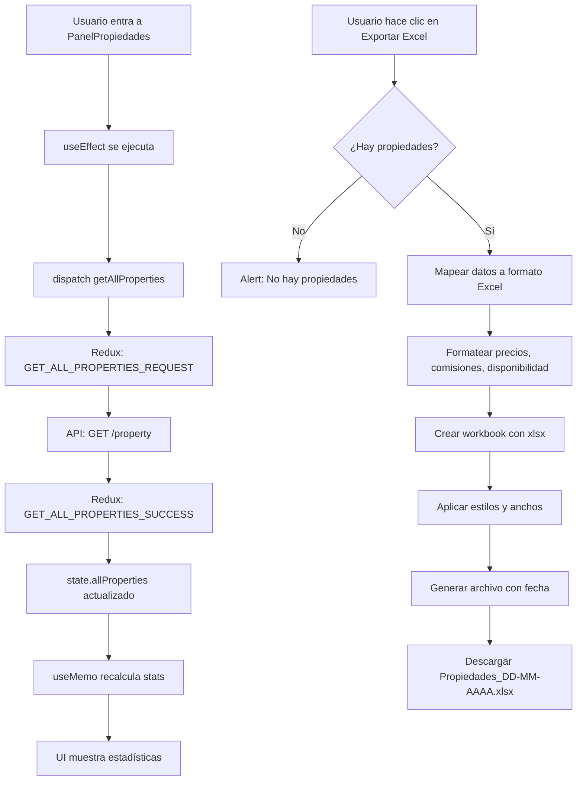

# 📊 Estadísticas y Exportación de Propiedades

## 🎯 Funcionalidades Implementadas

### 1. **Estadísticas en Tiempo Real**

El panel de propiedades ahora muestra estadísticas dinámicas calculadas a partir de los datos reales:

#### **Total Propiedades**
- Cuenta todas las propiedades registradas en el sistema
- Color: Verde esmeralda

#### **Disponibles**
- Propiedades con `isAvailable: true`
- Listas para venta o alquiler
- Color: Azul

#### **Vendidas/Alquiladas**
- Propiedades con `isAvailable: false`
- Ya no están en el mercado
- Color: Ámbar

#### **Con Clientes**
- Propiedades que tienen clientes asignados y están disponibles
- Indica propiedades en proceso de negociación
- Verifica `prop.clients.length > 0 && prop.isAvailable`
- Color: Púrpura

---

## 📥 Exportación a Excel

### **Botón "Exportar Excel"**

Ubicado en el header de la sección de estadísticas, permite descargar un archivo Excel completo con toda la información de propiedades.

### **Datos Exportados:**

| Columna | Fuente | Descripción |
|---------|--------|-------------|
| ID | `property.propertyId` | Identificador único |
| Dirección | `property.address` | Dirección completa |
| Barrio | `property.neighborhood` | Barrio de ubicación |
| Ciudad | `property.city` | Ciudad |
| Tipo Operación | `property.type` | Venta/Alquiler |
| Tipo Propiedad | `property.tipoPropiedad` | Casa, Depto, Terreno, etc. |
| Precio | `property.price` | Precio (con formato $) |
| Habitaciones | `property.rooms` | Cantidad de habitaciones |
| Baños | `property.bathrooms` | Cantidad de baños |
| Superficie Total | `property.superficieTotal` | m² totales |
| Superficie Cubierta | `property.superficieCubierta` | m² cubiertos |
| Disponible | `property.isAvailable` | Sí/No |
| Escritura | `property.escritura` | Tipo de escritura |
| Comisión | `property.comision` | Porcentaje (%) |
| Clientes Asignados | `property.clients.length` | Cantidad de clientes |
| Imágenes | `property.images.length` | Cantidad de imágenes |
| Link Maps | `property.linkMaps` | URL de Google Maps |
| Link Instagram | `property.linkInstagram` | URL de Instagram |
| Fecha Creación | `property.createdAt` | Fecha de registro (DD/MM/AAAA) |

### **Características del Excel:**

✅ **19 columnas completas** - Información exhaustiva de cada propiedad  
✅ **Anchos optimizados** - Cada columna con ancho apropiado  
✅ **Nombre dinámico** - `Propiedades_DD-MM-AAAA.xlsx`  
✅ **Formato .xlsx** - Compatible con Excel, Google Sheets, LibreOffice  
✅ **Hoja nombrada** - "Propiedades"  
✅ **Validación** - No exporta si no hay propiedades  
✅ **Formateo de datos** - Precios con $, comisiones con %, disponibilidad en texto

---

## 🔧 Implementación Técnica

### **Imports Necesarios:**

```javascript
import { useEffect, useMemo } from 'react';
import { useDispatch, useSelector } from 'react-redux';
import { getAllProperties } from '../../redux/Actions/actions';
import * as XLSX from 'xlsx';
```

### **Cálculo de Estadísticas con useMemo:**

```javascript
const stats = useMemo(() => {
  const totalPropiedades = properties.length;
  
  // Propiedades disponibles
  const disponibles = properties.filter(prop => 
    prop.isAvailable === true || prop.isAvailable === "true"
  ).length;

  // Propiedades no disponibles (vendidas/alquiladas)
  const noDisponibles = properties.filter(prop => 
    prop.isAvailable === false || prop.isAvailable === "false"
  ).length;

  // Propiedades con clientes asignados
  const enProceso = properties.filter(prop => 
    prop.clients && prop.clients.length > 0 && prop.isAvailable
  ).length;

  return {
    totalPropiedades,
    disponibles,
    noDisponibles,
    enProceso
  };
}, [properties]);
```

**¿Por qué useMemo?**
- Evita recalcular en cada render
- Solo recalcula cuando `properties` cambia
- Mejora el rendimiento significativamente

### **Función de Exportación:**

```javascript
const handleExportExcel = () => {
  if (properties.length === 0) {
    alert('No hay propiedades para exportar');
    return;
  }

  // Preparar datos con formato
  const excelData = properties.map(prop => ({
    'ID': prop.propertyId || '',
    'Dirección': prop.address || '',
    'Precio': prop.price ? `$${prop.price}` : '',
    'Disponible': prop.isAvailable ? 'Sí' : 'No',
    'Comisión': prop.comision ? `${prop.comision}%` : '',
    // ... otros campos
  }));

  // Crear Excel
  const wb = XLSX.utils.book_new();
  const ws = XLSX.utils.json_to_sheet(excelData);
  
  // Anchos de columna
  ws['!cols'] = [
    { wch: 8 },  // ID
    { wch: 40 }, // Dirección
    // ... otros anchos
  ];

  XLSX.utils.book_append_sheet(wb, ws, 'Propiedades');
  
  // Descargar
  const fecha = new Date().toLocaleDateString('es-AR').replace(/\//g, '-');
  XLSX.writeFile(wb, `Propiedades_${fecha}.xlsx`);
};
```

---

## 🎨 UI/UX

### **Loading State:**

```jsx
{loading ? (
  <div className="text-center py-8">
    <div className="animate-spin rounded-full h-12 w-12 border-b-2 border-emerald-400 mx-auto"></div>
    <p className="text-slate-300 mt-4">Cargando estadísticas...</p>
  </div>
) : (
  // Estadísticas
)}
```

### **Botón de Exportación:**

```jsx
<button
  onClick={handleExportExcel}
  disabled={loading || properties.length === 0}
  className="flex items-center space-x-2 px-4 py-2 bg-emerald-500/20 hover:bg-emerald-500/30 text-emerald-400 rounded-lg border border-emerald-400/30 transition-all duration-300 disabled:opacity-50 disabled:cursor-not-allowed"
>
  <IoDownloadOutline className="w-5 h-5" />
  <span className="hidden sm:inline">Exportar Excel</span>
  <span className="sm:hidden">Excel</span>
</button>
```

### **Cards de Estadísticas:**

Cada card incluye:
- Icono específico
- Valor numérico grande
- Label descriptivo
- Hover effect
- Responsive (2 cols mobile, 4 cols desktop)

---

## 📊 Flujo de Datos



---

## 🧪 Testing Manual

### **Escenario 1: Ver estadísticas**
1. ✅ Entrar a /panelPropiedades
2. ✅ Ver loading spinner
3. ✅ Ver estadísticas actualizadas
4. ✅ Verificar totales correctos

### **Escenario 2: Exportar con datos**
1. ✅ Tener propiedades en la BD
2. ✅ Hacer clic en "Exportar Excel"
3. ✅ Descargar `Propiedades_05-10-2025.xlsx`
4. ✅ Abrir y verificar:
   - 19 columnas
   - Datos completos
   - Formato de precios ($)
   - Formato de comisiones (%)
   - Disponibilidad (Sí/No)

### **Escenario 3: Exportar sin datos**
1. ✅ BD sin propiedades
2. ✅ Botón deshabilitado
3. ✅ Alert si intenta exportar

### **Escenario 4: Estadísticas diversas**
1. ✅ Propiedades disponibles
2. ✅ Propiedades vendidas/alquiladas
3. ✅ Propiedades con clientes asignados
4. ✅ Totales coinciden

---

## 🔮 Mejoras Futuras

### **Filtros Avanzados:**
```javascript
// Exportar solo propiedades filtradas
const handleExportFiltered = (filters) => {
  const filtered = properties.filter(prop => {
    // Por tipo, precio, ciudad, disponibilidad, etc.
  });
  // Generar Excel con filtered
};
```

### **Gráficos:**
```javascript
// Gráfico de propiedades por tipo
// Gráfico de precios por barrio
// Distribución de disponibilidad
```

### **Más Estadísticas:**
- Propiedades por tipo (casa, depto, terreno)
- Precio promedio por tipo
- Propiedades por ciudad/barrio
- Tiempo promedio en el mercado
- Tasa de conversión (vendidas vs disponibles)

### **Formatos Adicionales:**
- CSV para análisis
- PDF con fotos para catálogos
- JSON para backups

### **Análisis Avanzado:**
- Precio promedio por m²
- Comparativa de precios por zona
- Tendencias de mercado
- Propiedades más vistas (si tienes ese dato)

---

## 📁 Archivos Modificados

**`PanelPropiedades.jsx`:**
- Agregados imports: `useEffect`, `useMemo`, `useDispatch`, `useSelector`, `XLSX`
- Nueva función `handleExportExcel()`
- Nuevo cálculo `stats` con useMemo
- UI de estadísticas actualizada con datos reales
- Botón de exportación agregado
- Loading states mejorados

---

## 💡 Comparación con PanelClientes

Ambos paneles ahora tienen funcionalidad similar pero adaptada a sus datos:

| Característica | PanelClientes | PanelPropiedades |
|---------------|---------------|------------------|
| Estadísticas | 4 métricas | 4 métricas |
| Exportación Excel | ✅ | ✅ |
| Columnas Excel | 10 | 19 |
| Loading states | ✅ | ✅ |
| Responsive | ✅ | ✅ |
| Color principal | Azul | Verde esmeralda |

---

**Fecha de implementación:** ${new Date().toLocaleDateString('es-AR')}  
**Estado:** ✅ IMPLEMENTADO Y FUNCIONAL
