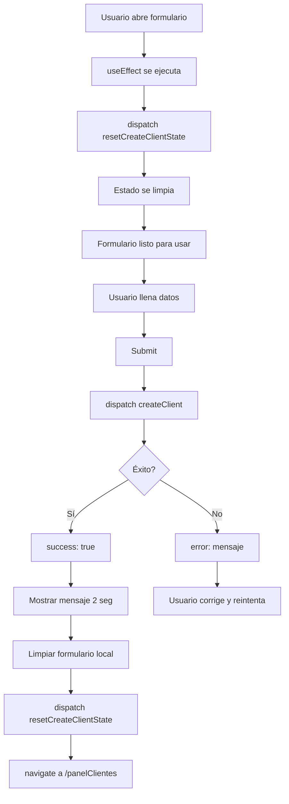

# 🐛 Solución: Estado de Creación de Cliente No se Limpia

## 📋 Problema Identificado

**Síntoma:** Después de crear un cliente exitosamente, al volver al formulario se mantiene el mensaje "Cliente creado con éxito" y no permite crear un nuevo cliente.

**Causa:** El estado de Redux `clientCreate` (con `success: true`) no se limpiaba al montar nuevamente el componente.

## 🔍 Análisis

### Estado en Redux:
```javascript
clientCreate: {
  loading: false,
  success: true,  // ❌ Se quedaba en true
  error: null
}
```

Este estado persiste en Redux incluso después de:
- Cerrar el formulario
- Navegar a otra página
- Volver al formulario de creación

## ✅ Solución Implementada

### 1. **Nuevo Action Type** (`actions-types.js`)

```javascript
export const RESET_CREATE_CLIENT_STATE = "RESET_CREATE_CLIENT_STATE";
```

### 2. **Nueva Action Creator** (`actions.js`)

```javascript
// Acción para limpiar el estado de creación de cliente
export const resetCreateClientState = () => ({
  type: RESET_CREATE_CLIENT_STATE
});
```

### 3. **Nuevo Case en Reducer** (`reducer.js`)

```javascript
case RESET_CREATE_CLIENT_STATE:
  return {
    ...state,
    clientCreate: {
      loading: false,
      success: false,   // ✅ Reinicia a false
      error: null,
    },
  };
```

### 4. **Limpiar Estado al Montar Componente** (`Clientes.jsx`)

```javascript
// Limpiar el estado cuando el componente se monta
useEffect(() => {
  dispatch(resetCreateClientState());
}, [dispatch]);
```

### 5. **Limpiar Estado Antes de Redirigir**

```javascript
// Efecto para manejar redirección exitosa
useEffect(() => {
  if (success) {
    // Limpiar formulario
    setFormData(initialState);
    setValidationErrors({});
    
    // Redirigir después de 2 segundos
    const timer = setTimeout(() => {
      dispatch(resetCreateClientState()); // ✅ Limpia antes de navegar
      navigate('/panelClientes');
    }, 2000);
    
    return () => clearTimeout(timer);
  }
}, [success, navigate, dispatch]);
```

## 🎯 Flujo Completo



## 📊 Comparación Antes/Después

### ❌ ANTES:
1. Usuario crea cliente → success: true
2. Usuario navega a /panelClientes
3. Usuario vuelve al formulario
4. **Estado sigue en success: true** ❌
5. Se muestra mensaje de éxito inmediatamente
6. No se puede crear nuevo cliente

### ✅ DESPUÉS:
1. Usuario crea cliente → success: true
2. Usuario navega a /panelClientes
3. Usuario vuelve al formulario
4. **useEffect ejecuta resetCreateClientState** ✅
5. Estado limpio: success: false
6. Formulario listo para nuevo cliente

## 🛠️ Archivos Modificados

1. **`actions-types.js`** - Agregado `RESET_CREATE_CLIENT_STATE`
2. **`actions.js`** 
   - Importado `RESET_CREATE_CLIENT_STATE`
   - Creado `resetCreateClientState()`
3. **`reducer.js`** 
   - Importado `RESET_CREATE_CLIENT_STATE`
   - Agregado case para manejar el reset
4. **`Clientes.jsx`**
   - Importado `resetCreateClientState`
   - Agregado `useEffect` para limpiar al montar
   - Mejorado `useEffect` de éxito para limpiar antes de redirigir

## 🧪 Testing Manual

### Escenario 1: Crear cliente exitoso
1. ✅ Llenar formulario
2. ✅ Submit
3. ✅ Ver mensaje de éxito
4. ✅ Esperar 2 segundos
5. ✅ Redirigir a panel
6. ✅ Volver al formulario
7. ✅ **Formulario limpio, sin mensaje**

### Escenario 2: Error al crear
1. ✅ Llenar formulario con datos inválidos
2. ✅ Submit
3. ✅ Ver mensaje de error
4. ✅ Corregir datos
5. ✅ Submit nuevamente
6. ✅ Cliente creado correctamente

### Escenario 3: Navegación múltiple
1. ✅ Ir al formulario
2. ✅ Salir sin crear
3. ✅ Volver al formulario
4. ✅ **Estado limpio**

## 💡 Patrón Aplicable

Este mismo patrón se puede aplicar a otros formularios:

```javascript
// En cualquier componente de creación:
useEffect(() => {
  dispatch(resetCreateXState()); // X = Property, Lease, etc.
}, [dispatch]);

// Y antes de redirigir:
dispatch(resetCreateXState());
navigate('/destino');
```

## 📝 Notas Importantes

1. **¿Por qué limpiar dos veces?**
   - Al montar: Para usuarios que vuelven al formulario
   - Antes de redirigir: Para evitar flash del mensaje en próxima visita

2. **¿Por qué no limpiar en unmount?**
   - Porque necesitamos mantener el estado para mostrar el mensaje de éxito
   - La limpieza en mount es más confiable

3. **Validación local también se limpia:**
   ```javascript
   setValidationErrors({});
   ```

---

**Fecha de corrección:** ${new Date().toLocaleDateString('es-AR')}  
**Estado:** ✅ RESUELTO
